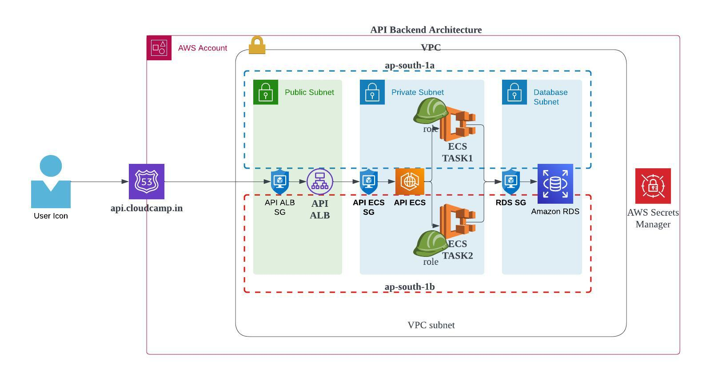

# Devops API App

## install the node packages for the api tier:

```sh
→ npm install
```

## start the app

```sh
→ npm start
```

## NOTE this app uses two env variables:

- PORT: the listening PORT
- DB: Name of the database to connect
- DBUSER: Database user
- DBPASS: DB user password,
- DBHOST: Database hostname,
- DBPORT: Database server listening port

These variables need to be set

#### Architecture

**NOTE:** Since we are doing backend application first. I am provisioning API ALB into public subnet for testing. Ideally it should be in private subnets and accept traffic only from Web ECS Service. We can implement this later.

* First we need to build the application through docker build.
* Push to AWS ECR Repo.

